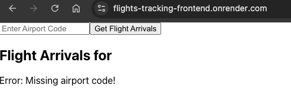
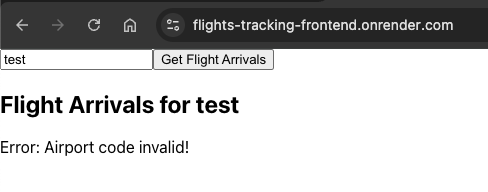
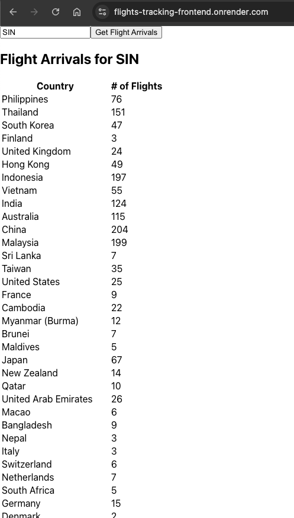

# flights-tracking

Learning app to use FastAPI and Python

# Overview

The user will enter a 3-character airport code, such as SIN for Singapore Changi Airport.
The tool will query the `FlightAPI.io` API and display a table with two columns:

- Country – The country flights are arriving from.
- Number of Flights – The number of flights originating from that country and arriving at the entered airport.

## Sample screenshots

- Missing input
  
- Invalid input
  
- Correct input (use `SIN` for mocked data)
  

# Structure

```
├── backend -> use FastAPI framework to build API endpoints
│   └── app
└── frontend -> use React to host the form
    ├── public
    └── src
```

# How to run on local

## Backend

Backend is built with Python3 and FastAPI framework to establish the main endpoint `/api/flights/arrivals/{airport_code}` for front end to call to.

- FastAPI is used because its interface is simple enough to learn and it supports asynchronous operation quite well.
- Instead of using `requests` lib to make synchronous API calls to the external party, `httpx` is used because it supports async requests.
- The input validation should use `pydantic` model schema because it is more robust solution (but I haven't learned it enough to use yet :joy:)

A limitation is `FlightAPI.io` charges credits for every call so for demo purpose, the backend will use mock data from `/app/services/sample.json` to return the result.
So this only works with the input airport code `SIN` :laughing:

In reality, there should be a caching layer (like Redis) to cache data then store to database (like Postgres) so the backend can fetch from there to serve.

Steps:

- Activate virtual environment when developing for the first time (see https://fastapi.tiangolo.com/virtual-environments/)
- Run `pip install -r requirements.txt`
- Copy `.env.example` to `.env` to use

```
HOST=localhost
PORT=3000
API_KEY=<API KEY from FlightAPI.io>
USE_MOCK_DATA=true
REACT_APP_HOST=http://localhost:5001
```

- Run `uvicorn app.main:app --port=3000 --reload` or `python3 -m app.main` to start the server

## Frontend

Frontend is created with create-react-app and uses `react-query` to query API endpoints exposed from the backend.
_Notes: currently react-query does not work with React 19 yet, so need to downgrade to React 18._

Steps:

- Run `npm install`
- Copy `.env.example` to `.env` to use

```
REACT_APP_API_BASE_URL=http://localhost:3000/api
PORT=5001
```

- Run `npm run start`

# How to deploy

For demo purpose, both backend and frontend parts use render.com platform to host on FREE tier.

- Backend uses `dockerfile` to containerize the application.
- Frontend is built and exposed as a static site.
- The `render.yaml` defines backend as a web service and frontend as a static site to deploy.
